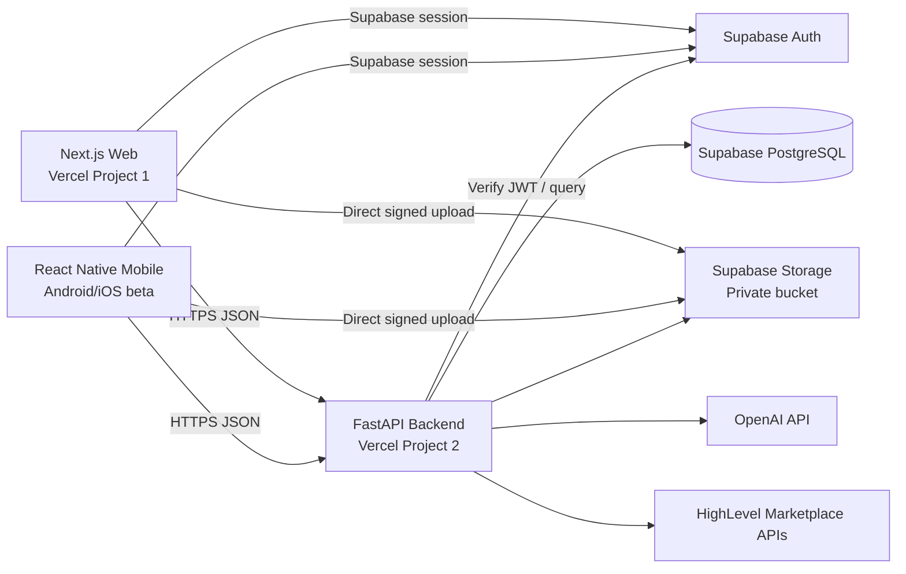
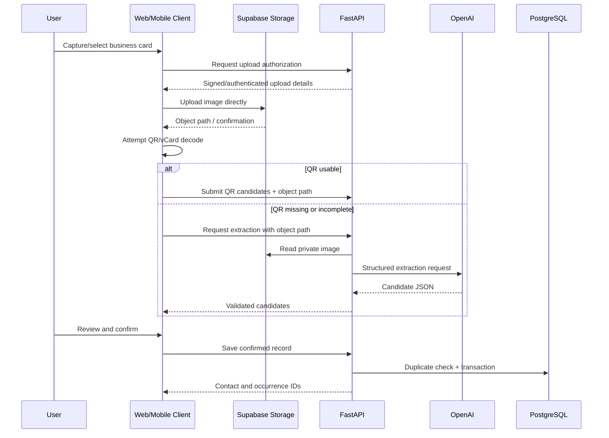
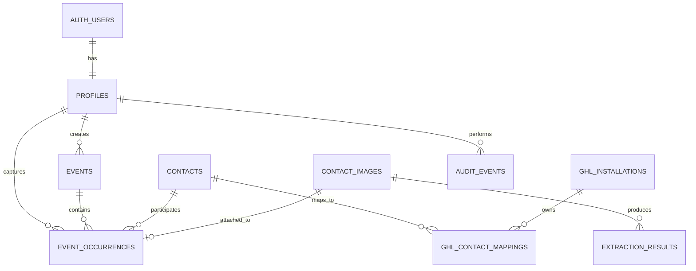
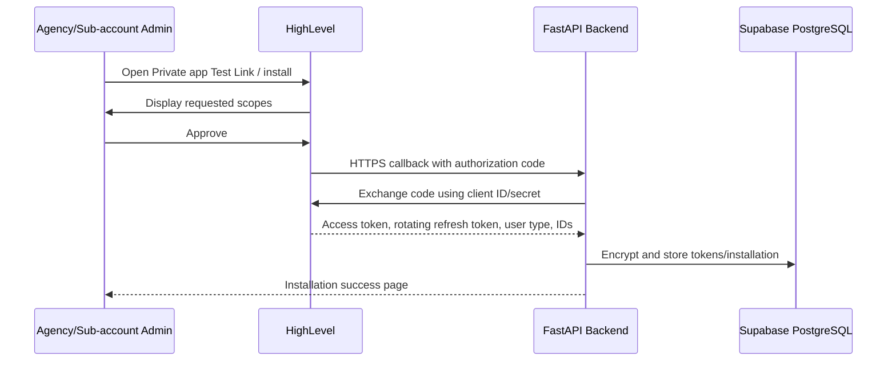

# Software Requirements Specification

## Contact Capture and Event Management System - MVP Pilot Edition

**Minimum Viable Product, Human-AI Orchestration, Deployment, Mobile Distribution, and HighLevel Marketplace Feasibility Edition**

| Document Control | Value |
|---|---|
| Document Version | 3.0 MVP Pilot Edition |
| Document Status | Revamped Draft for Stakeholder Approval |
| Source Baseline | Software Requirements Specification Version 2.1, dated July 23, 2026 |
| Prepared Date | July 24, 2026 |
| Delivery Target | 1 to 2 calendar weeks, assuming 5 to 10 working days |
| Delivery Method | Extreme Programming with a custom Claude Code Kiro-style Spec-Driven Development skill |
| Core Repositories | Separate frontend, backend, and mobile repositories |
| Hosting Baseline | Vercel Free/Hobby and Supabase Free, subject to eligibility and free-tier limitations |
| Database Decision | PostgreSQL in local development, staging, and pilot production |
| Mobile Release Goal | Controlled beta installation without public store publication |
| HighLevel Goal | Private Marketplace app installation and OAuth validation in Agency/Sub-account sandbox environments |
| Confidentiality | Internal and Authorized Client Use |

## Document Purpose

This document replaces the enterprise-scale implementation plan in Version 2.1 with a deliberately constrained MVP pilot. It preserves the core business outcome of the source SRS: an authenticated user captures a contact, reviews machine-extracted values, checks phone before email for duplicates, maintains one contact record, and records each interaction as a separate event occurrence.

The source SRS is comprehensive but materially exceeds a 1-to-2-week delivery window. It includes enterprise hosting, queues, multiple OCR providers, detailed user administration, advanced RBAC, reporting, notifications, audit coverage, backup and disaster recovery, formal performance targets, multilingual extraction, public mobile-store release, and a ten-sprint plan. This edition narrows those requirements to a testable pilot and records what is retained, simplified, deferred, or rejected.

## Evidence and Fact-Check Basis

This revision uses two evidence classes:

1. **Source-derived requirements:** business intent, contact matching priority, event-occurrence model, mandatory human review, target web/mobile technologies, FastAPI, PostgreSQL, and HighLevel integration concepts from the Version 2.1 SRS.
2. **External fact-checks:** official product documentation from Supabase, Vercel, Google Play, Apple Developer, HighLevel, Anthropic, Kiro, and OpenAI, reviewed on July 24, 2026.

Where the source SRS and current provider constraints conflict, this edition explicitly records the correction rather than silently preserving the conflict.

## Approval Block

| Role | Name | Approval / Signature | Date |
|---|---|---|---|
| Product Owner / Client Representative |  |  |  |
| Technical Lead / Solutions Architect |  |  |  |
| Delivery Lead / Project Manager |  |  |  |
| QA / Release Reviewer |  |  |  |
| Security and Privacy Reviewer |  |  |  |

## Revision History

| Version | Date | Description |
|---|---|---|
| 2.1 | July 23, 2026 | Enterprise-oriented baseline with human-AI orchestration, ten sprints, AWS infrastructure, GHL integration, and full cost model. |
| 3.0 | July 24, 2026 | Re-scoped to a 1-to-2-week MVP; replaced AWS infrastructure with Vercel/Supabase pilot architecture; standardized PostgreSQL across environments; introduced three repositories; fact-checked beta mobile distribution, HighLevel Marketplace installation, Claude/Kiro workflow, and tool budget. |

# 1. Executive Review and Feasibility Determination

## 1.1 Overall Determination

A **working MVP pilot is feasible in 1 to 2 weeks** only when all of the following are true:

- Two experienced engineers are available full-time and can cover architecture, backend, web, mobile, QA, and deployment responsibilities.
- A Product Owner is available for same-day decisions and acceptance.
- The scope is frozen to the Must Have items in Section 3.
- Existing Apple Developer, Google Play Console, and HighLevel Developer/Sandbox accounts are available before Day 1 when those validation tracks are required.
- Public App Store, public Google Play, and public HighLevel Marketplace publication are not part of the time commitment.
- The deployment is treated as a **non-commercial evaluation or internal pilot** if Vercel Hobby is used. Vercel states that Hobby is restricted to non-commercial, personal use. A commercial client or agency production deployment requires a paid Vercel plan even if the application technically fits Hobby limits. [FC-VER-01]
- Supabase Free is treated as pilot infrastructure rather than an enterprise production platform. It has two active free projects, 500 MB database capacity per project, 1 GB file storage, project pausing after inactivity, no automatic backups, and no uptime SLA. [FC-SUP-01] [FC-SUP-02]

## 1.2 Feasibility Verdict by Requested Item

| Requested Item | Verdict | Conditions / Correction |
|---|---|---|
| Make the source SRS an MVP | **Feasible** | Remove enterprise features, retain one end-to-end capture workflow, and defer noncritical modules. |
| SQLite for development and staging | **Not recommended** | SQLite may be used for isolated unit tests only. It creates staging/production dialect and concurrency divergence. |
| PostgreSQL for development, staging, and production | **Selected** | Local PostgreSQL for development; Supabase Project A for staging; Supabase Project B for pilot production. |
| Supabase Free deployed PostgreSQL | **Feasible for pilot** | Two hosted projects fit staging and pilot production. A third hosted development project does not fit the free allocation. Development remains local PostgreSQL. |
| Vercel Free for frontend and backend | **Technically feasible, legally conditional** | Next.js and FastAPI can run on Vercel. Hobby is non-commercial only. Images must upload directly to Supabase Storage because Vercel Functions have a 4.5 MB request body limit. [FC-VER-01] [FC-VER-02] [FC-VER-03] |
| Android installation without public release | **Feasible** | Use Google Play Internal App Sharing or Internal Testing. Internal App Sharing links expire after 60 days and allow up to 100 downloads per link; they are not literal one-use links. [FC-GPL-01] [FC-GPL-02] |
| iOS installation without public release | **Feasible with constraints** | Use TestFlight. A build is available for up to 90 days; external testers can use a public link; first external beta build requires review. An arbitrary one-time IPA link is not feasible for general iOS devices. [FC-APL-01] [FC-APL-02] |
| Literal one-time download link for both platforms | **Not feasible as one common store-compliant pattern** | Android can use a custom expiring/single-consumption APK link with sideloading. iOS requires TestFlight or device-registered Ad Hoc distribution. Replace requirement with a controlled time-limited beta-install link. |
| Two Claude Pro accounts only | **Feasible for two individual operators** | Each human uses a separate account. Claude Pro includes Claude Code but remains usage-limited. [FC-ANT-01] [FC-ANT-02] |
| Kiro Spec-Driven Development without Kiro IDE subscription | **Feasible as a custom Claude Code skill, with corrected naming** | Kiro Specs are an official Kiro feature. Claude supports custom skills. The project can implement a **Kiro-style SDD custom skill**, but should not represent it as the official Kiro IDE feature. [FC-KIR-01] [FC-ANT-03] |
| OpenAI API Keys budget | **Feasible** | API keys are not purchased as subscriptions. Prepaid API usage starts at a $5 minimum; credits expire after one year. Disable automatic recharge, use application-level quotas, and treat provider spend thresholds as monitoring controls rather than a guaranteed hard cap. [FC-OAI-01] [FC-OAI-02] |
| HighLevel Marketplace installation in Agency and Sub-accounts | **Feasible as a Private app pilot** | Use a Private Marketplace app, target Sub-account, allow both Agency and Sub-account installers, test with a sandbox Test Link, and validate OAuth/token refresh. Public Marketplace approval is outside the 1-to-2-week guarantee. [FC-GHL-01] [FC-GHL-02] [FC-GHL-03] |
| Three repositories | **Feasible and selected** | Separate repositories for frontend, backend, and mobile; shared API contract through versioned OpenAPI artifacts. |

## 1.3 Go / No-Go Decision

The MVP may start only when the following Day-0 prerequisites are confirmed:

| Gate | Required Evidence | Result if Missing |
|---|---|---|
| Product scope | Signed Must Have list and deferred-feature list | Reduce scope before development. |
| Accounts | GitHub, Vercel, Supabase, OpenAI, and HighLevel credentials available | Block affected deployment/integration work. |
| Mobile accounts | Existing Google Play and Apple Developer access when store-based beta is required | Use Android sideloading only; defer iOS beta. |
| Apple build environment | macOS and Xcode access | Defer iOS build and TestFlight. |
| HighLevel sandbox | Agency and at least one Sub-account/Location available | Defer Marketplace installation to post-MVP. |
| Vercel eligibility | Stakeholder confirms non-commercial/personal Hobby eligibility | Use a paid Vercel plan or do not deploy a commercial pilot on Hobby. |
| Privacy approval | Pilot data notice and approved test-data policy | Use synthetic data only. |
| Team capacity | Two full-time technical operators and daily Product Owner availability | Deliver web-only MVP or extend schedule. |

# 2. Deep Review of the Version 2.1 Source SRS

## 2.1 Strengths Retained

The source document contains sound product and engineering principles that remain applicable:

- One master contact may have many event occurrences.
- Exact normalized phone matching is evaluated before normalized email matching.
- QR, OCR, and AI results are proposed values; a user reviews and edits them before saving.
- Ambiguous matches are not automatically merged.
- User-confirmed values outrank automated values.
- Contact and event-occurrence persistence must be logically consistent.
- AI tools assist delivery but do not approve requirements, architecture, security, quality, or release decisions.
- Web and mobile clients share documented API behavior.

## 2.2 Material Problems in the Enterprise Baseline

| Finding ID | Finding | Impact | MVP Resolution |
|---|---|---|---|
| REV-001 | The original scope combines a product MVP, enterprise platform, operational model, security program, reporting suite, and future roadmap. | Cannot be completed in 1 to 2 weeks. | Keep one primary capture journey and one controlled HighLevel sync path. |
| REV-002 | The architecture includes AWS Amplify, WAF, ALB, EC2 Auto Scaling, SQS, RDS, S3, CloudWatch, Sentry, Secrets Manager, multiple workers, Textract, Tesseract, OpenAI, and GHL. | Excessive setup, integration, and operational complexity. | Replace with Vercel, Supabase, and OpenAI; no queue or worker in MVP. |
| REV-003 | The document states that GHL Media replaces S3, but multiple later workflows still require temporary S3 storage, S3 promotion, S3 consistency, and S3-specific controls. | Conflicting source of truth and implementation ambiguity. | Supabase Storage is the only MVP image store. GHL media upload is deferred. |
| REV-004 | The document describes GHL as canonical for contacts while also defining a full local contacts table and transactional local merge behavior. | Unclear ownership and failure semantics. | Supabase is the MVP source of truth; GHL is a synchronized downstream system. |
| REV-005 | Custom JWT access/refresh-token implementation duplicates capabilities available in Supabase Auth. | Adds security-sensitive code and testing. | Use Supabase Auth; backend verifies Supabase JWTs. |
| REV-006 | Multilingual OCR provider routing, PDFs, QR, confidence scoring, fallbacks, and AI merging are all required. | Too much processing scope for ten working days. | Support JPEG/PNG, QR/vCard, and one OpenAI structured-extraction fallback; no guaranteed confidence score. |
| REV-007 | Full user administration, granular RBAC, Viewer/Support/API Consumer roles, exports, notifications, audit reports, and dashboards are included. | Large horizontal feature footprint. | Seed users through Supabase; support Admin and Staff only; basic list screens and minimal audit events. |
| REV-008 | 1,000 concurrent users, 99.9% availability, RTO/RPO, formal load testing, and automatic backups are required. | Incompatible with free tiers and a pilot schedule. | Replace with pilot capacity assumptions and explicit free-tier limitations. |
| REV-009 | Mobile release language mixes public store distribution, enterprise distribution, and approved marketplaces. | Unclear acceptance target and external review dependency. | Use Google internal distribution and Apple TestFlight only; no public listing. |
| REV-010 | The ten-sprint roadmap recommends 20 to 24 weeks and the labor model exceeds 5,000 hours. | Contradicts the requested 1-to-2-week objective. | Replace with a ten-working-day, two-person plan and strict scope freeze. |
| REV-011 | The attachment table contains a business-card requirement statement tied to the selfie configuration. | UX/validation ambiguity. | In the image-assisted flow, business card is required; selfie is removed from MVP. |
| REV-012 | Section numbering places 3.22 before 3.19. | Editorial inconsistency. | Renumber this edition sequentially. |
| REV-013 | Public marketplace/store review times are treated as delivery activities despite being outside team control. | Schedule risk. | Submission or private test setup may be completed; provider approval is not a committed outcome. |

## 2.3 Scope Reduction Principles

1. Preserve the business outcome, not every enterprise mechanism.
2. Prefer managed platform capabilities over custom security-sensitive code.
3. Use one provider per capability in the MVP.
4. Keep all data stores PostgreSQL-compatible.
5. Defer asynchronous processing until actual latency or reliability evidence requires it.
6. Treat external marketplace approval as a dependency, not a sprint deliverable.
7. Distinguish a pilot from production: free plans, no SLA, no automatic backups, and limited support are acceptable only with explicit stakeholder consent.

# 3. MVP Product Scope

## 3.1 MVP Product Goal

Enable an authorized user on web or mobile to select an event, manually enter or photograph a business card, receive QR/AI-assisted field suggestions, review and correct the suggestions, resolve exact duplicates using phone before email, save one contact and a new event occurrence, and optionally synchronize the contact to an installed HighLevel Sub-account.

## 3.2 Must Have Scope

| ID | Capability | MVP Requirement |
|---|---|---|
| MVP-001 | Authentication | Email/password login through Supabase Auth. |
| MVP-002 | Basic authorization | Admin and Staff roles stored in `profiles`; server-side authorization on protected actions. |
| MVP-003 | Event management | Create, list, select, and edit active events. |
| MVP-004 | Manual contact capture | Enter name, company, title, phone, email, website, and notes. |
| MVP-005 | Business-card image capture | Upload/capture one JPEG or PNG business-card image; maximum 5 MB by MVP policy. |
| MVP-006 | QR/vCard extraction | Detect a QR code and parse supported vCard/contact fields when available. |
| MVP-007 | AI-assisted extraction | When QR is missing or incomplete, invoke OpenAI server-side and return structured contact candidates. |
| MVP-008 | Human review | Display every proposed value in an editable form before save. |
| MVP-009 | Deterministic validation | Validate required names and at least one phone/email identifier; normalize phone/email. |
| MVP-010 | Duplicate detection | Exact normalized phone first, then exact normalized email. |
| MVP-011 | Contact resolution | Create a contact or update a matched contact after explicit review. |
| MVP-012 | Event occurrence | Create a separate occurrence for every confirmed interaction. |
| MVP-013 | Basic retrieval | List contacts, contact details, event list, and occurrence history. |
| MVP-014 | Minimal audit | Record login-independent critical write events: capture, update, duplicate decision, GHL sync result. |
| MVP-015 | HighLevel OAuth pilot | Install a Private Marketplace app into a sandbox Location and store encrypted rotating tokens. |
| MVP-016 | HighLevel contact sync | Create or update a GHL contact after local save, with visible `synced`, `pending`, or `failed` status. |
| MVP-017 | Web deployment | Next.js frontend on Vercel. |
| MVP-018 | API deployment | FastAPI backend on a separate Vercel project. |
| MVP-019 | Database and storage | Supabase PostgreSQL, Auth, and Storage. |
| MVP-020 | Mobile beta build | React Native Android build; iOS build when Apple prerequisites are available. |
| MVP-021 | Three repositories | Separate frontend, backend, and mobile Git repositories. |

## 3.3 Should Have Scope

These items may be implemented only after all Must Have acceptance criteria pass:

- Basic search by contact name, company, phone, or email.
- User-visible retry of a failed OpenAI extraction.
- User-visible retry of a failed HighLevel synchronization.
- Manual conflict selection when existing and incoming values differ.
- Android Internal App Sharing link.
- iOS TestFlight external-testing link.
- Minimal dashboard counts: contacts, events, captures, failed syncs.

## 3.4 Could Have Scope

- Dark mode.
- CSV export of a small filtered contact list.
- HighLevel custom page or custom menu integration.
- Agency bulk-install validation across more than one Sub-account.
- Basic image compression before upload.

## 3.5 Explicitly Out of Scope for the 1-to-2-Week MVP

- Selfie capture and storage.
- Facial recognition or biometric processing.
- PDF business cards.
- Guaranteed Japanese/Chinese/English OCR routing or multiple OCR providers.
- AWS Textract, Tesseract fallback, SQS, Celery, or background worker services.
- HighLevel Media Storage synchronization.
- Public Apple App Store publication.
- Public Google Play production publication.
- Public HighLevel Marketplace approval/publication.
- Full user-management UI, password administration, invitation workflow, or granular permission editor.
- Viewer, Support, API Consumer, and custom role administration.
- Offline synchronization.
- Push notifications, email notifications, reminders, or campaigns.
- Advanced merge of two persisted contacts.
- Reports, PDF/XLSX exports, dashboards, and scheduled analytics.
- 1,000-user load target, 99.9% SLA, formal disaster recovery, point-in-time recovery, or enterprise support.
- Formal WCAG certification, penetration test, compliance certification, or legal opinion.
- Multi-tenancy beyond the minimum HighLevel Agency/Location mapping needed for the pilot.

# 4. Users, Roles, and Authorization

## 4.1 MVP User Roles

| Role | Permitted Actions |
|---|---|
| Admin | Create/edit events, capture/update contacts, view all pilot records, retry sync, view minimal audit records, configure the pilot HighLevel installation. |
| Staff | Select events, capture contacts, review extraction, update authorized contacts, view occurrence history. |

## 4.2 Removed Roles

Viewer, Support/QA, DevOps Administrator, and API Consumer remain future roles. Their inclusion in the enterprise baseline is not justified for the 1-to-2-week pilot.

## 4.3 Authorization Rules

- Supabase Auth owns identity, password handling, sessions, password reset, and JWT issuance.
- `profiles.role` contains `admin` or `staff`.
- The backend must verify the Supabase JWT for every protected API request.
- The frontend/mobile role display is convenience only; server authorization is authoritative.
- Storage access must use Supabase Storage policies and short-lived signed URLs or authenticated direct upload.
- Service-role credentials must never be included in browser or mobile builds.

# 5. Functional Requirements

## 5.1 Authentication - `FR-MVP-AUTH-001`

### Requirement

An authorized pilot user shall sign in with email and password using Supabase Auth and receive a session that can be used by web and mobile clients.

### Business Rules

- Only active pilot users may access protected workflows.
- Passwords are managed by Supabase Auth; the application does not store password hashes.
- Session tokens are stored using platform-appropriate secure storage.
- The backend validates token signature, expiration, issuer, and audience/claims as configured.

### Acceptance Criteria

| ID | Criterion |
|---|---|
| AC-AUTH-001 | A seeded active user can sign in from web and mobile. |
| AC-AUTH-002 | Invalid credentials return a generic error. |
| AC-AUTH-003 | A request without a valid token is rejected. |
| AC-AUTH-004 | Role-protected endpoints reject a Staff user when Admin permission is required. |
| AC-AUTH-005 | No custom refresh-token database table or custom password-hashing code exists in the MVP. |

## 5.2 Event Management - `FR-MVP-EVT-001`

### Required Fields

| Field | Required | Rule |
|---|---:|---|
| Event name | Yes | 2 to 150 characters. |
| Event date/time | Yes | ISO 8601; stored in UTC. |
| Location | No | Maximum 255 characters. |
| Notes | No | Maximum 2,000 characters. |
| Status | Yes | `active` or `archived` in MVP. |

### Acceptance Criteria

- Admin can create and edit an event.
- Admin and Staff can list and select active events.
- Archived events cannot receive new captures.
- Existing occurrences remain available when an event is archived.

## 5.3 Manual Contact Capture - `FR-MVP-CON-001`

### Fields

| Field | Required | Validation |
|---|---:|---|
| First name | Yes | Trimmed; 1 to 100 characters. |
| Last name | Yes | Trimmed; 1 to 100 characters. |
| Company | No | Maximum 150 characters. |
| Position | No | Maximum 150 characters. |
| Phone | Conditional | At least phone or email is required; normalized where possible. |
| Email | Conditional | Valid syntax; trim; lowercase domain. |
| Website | No | HTTP/HTTPS URL. |
| Address | No | Maximum 500 characters. |
| Occurrence notes | No | Maximum 2,000 characters. |

### Acceptance Criteria

- A user can save a valid manual contact against an active event.
- At least one valid phone or email is required.
- The system runs duplicate detection before persistence.
- A new or matched contact receives a new event occurrence.

## 5.4 Business-Card Upload - `FR-MVP-IMG-001`

### Requirement

The user may capture or select one JPEG or PNG business-card image. The client shall upload it directly to a private Supabase Storage bucket rather than proxying the file through the Vercel FastAPI function.

### Validation Rules

- Accepted MIME types: `image/jpeg`, `image/png`.
- MVP maximum: 5 MB.
- Filename is replaced with a generated object path.
- The client records upload progress and allows cancel/retry.
- Image must be decodable.
- Public bucket access is prohibited.
- Default retention for pilot images is 30 days unless the Product Owner approves a shorter period.

### Acceptance Criteria

- A valid image uploads directly to Supabase Storage.
- An invalid type or file above 5 MB is rejected before upload.
- The API receives an object path, not a multipart image body.
- A saved occurrence references the correct image metadata.

## 5.5 QR/vCard Processing - `FR-MVP-QR-001`

### Requirement

The client or backend shall attempt QR decoding before AI extraction. A valid vCard or equivalent contact payload shall populate candidate fields with source `qr`.

### Rules

- URLs or arbitrary text are not treated as complete contact records.
- Parsed phone/email values still pass deterministic validation.
- Incomplete QR data may be supplemented by AI extraction.
- Unsafe links are displayed as data and are never opened automatically.

### Acceptance Criteria

- A test vCard QR populates expected fields.
- No QR or unsupported QR routes to AI extraction.
- QR-derived values remain editable.

## 5.6 OpenAI-Assisted Extraction - `FR-MVP-AI-001`

### Requirement

The backend shall retrieve the private business-card image and call an approved OpenAI vision-capable model using a strict structured-output schema. The service shall return only the approved contact fields and source metadata.

### MVP Output Schema

```json
{
  "first_name": "string|null",
  "last_name": "string|null",
  "company": "string|null",
  "position": "string|null",
  "phone": "string|null",
  "email": "string|null",
  "website": "string|null",
  "address": "string|null",
  "warnings": ["string"]
}
```

### Rules

- OpenAI credentials exist only in the backend Vercel environment.
- Send only the business-card image and instructions needed for extraction.
- Do not send selfies, unrelated event notes, GHL tokens, or user credentials.
- Model output is untrusted until schema validation and human review.
- The MVP does not claim vendor-calibrated confidence percentages.
- One bounded retry is permitted for transient provider errors.
- On failure, manual entry remains available.

### Acceptance Criteria

- The backend returns schema-valid candidates for representative test cards.
- Unexpected fields are rejected or ignored.
- Invalid phone/email values are flagged.
- Provider failure does not delete the image or event draft.
- Every proposed value remains editable before save.

## 5.7 Human Review - `FR-MVP-REV-001`

### UX Requirements

The review screen shall show:

- Contact fields.
- Event context.
- Image thumbnail.
- Source badge: Manual, QR, or AI.
- Field-level validation errors.
- Existing-contact match summary when applicable.
- Final action: Create Contact or Update Existing Contact and Add Occurrence.

### Acceptance Criteria

- The user can change every proposed contact value.
- The system revalidates edited fields.
- No extracted value is saved before user confirmation.
- The final confirmation clearly states whether a contact will be created or updated.

## 5.8 Duplicate Detection - `FR-MVP-DUP-001`

### Algorithm

1. Normalize phone when present.
2. Search contacts by exact `phone_normalized`.
3. If exactly one phone match exists, select it as the primary candidate.
4. If no phone match exists, normalize and search exact `email_normalized`.
5. If exactly one email match exists, select it.
6. If phone and email identify different contacts, stop and require Admin review; the MVP does not auto-merge.
7. If multiple records share an identifier, stop and require Admin review.
8. If no match exists, create a contact.

### Acceptance Criteria

- Phone is checked before email.
- Email is checked only when no deterministic phone match is selected.
- No-match creates a new contact.
- A match never creates a second contact automatically.
- A match still creates a new event occurrence.
- Ambiguous candidates are not automatically changed.

## 5.9 Contact Update - `FR-MVP-UPD-001`

### Default Merge Behavior

| Existing Value | Incoming Value | MVP Action |
|---|---|---|
| Empty | Valid non-empty | Add after user confirmation. |
| Same after normalization | Same | Keep existing; no material change. |
| Different | Manually confirmed | Show both; user chooses. |
| Different | AI/QR suggestion only | Preserve existing unless user explicitly selects incoming value. |

The MVP does not merge two persisted contact records. That operation is deferred because it requires broader relationship reassignment, audit, rollback, and authorization controls.

## 5.10 Event Occurrence - `FR-MVP-OCC-001`

Every confirmed capture shall create an occurrence containing:

- Contact ID.
- Event ID.
- Capturing user ID.
- Captured timestamp.
- Capture method: `manual`, `image`, `qr`, or `mixed`.
- Interaction notes.
- Business-card image ID when present.
- Duplicate resolution: `new`, `phone_match`, `email_match`, or `admin_resolved`.
- HighLevel sync status.

## 5.11 HighLevel Synchronization - `FR-MVP-GHL-001`

### Requirement

After a successful local save, the backend shall attempt to create or update the corresponding contact in the installed HighLevel Sub-account.

### Rules

- Supabase is the MVP system of record.
- GHL synchronization occurs after the local transaction commits.
- The UI may show `pending` while GHL completes.
- Retry once for transient network/rate-limit failures.
- Preserve a visible failed state and an Admin retry action.
- Store the GHL contact ID in `ghl_contact_mappings`.
- Never expose access/refresh tokens to frontend or mobile clients.

### Acceptance Criteria

- A sandbox installation can authorize the app through OAuth.
- A local contact can be synchronized to one sandbox Location.
- A later local update changes the mapped GHL contact.
- Token refresh rotation is stored atomically.
- A GHL failure does not roll back an already accepted local contact capture.

## 5.12 Basic Retrieval - `FR-MVP-READ-001`

The web and mobile clients shall support:

- Active event list.
- Contact list with simple pagination.
- Contact detail.
- Event occurrence history.
- Sync status.

Advanced reports, exports, aggregates, and dashboards are deferred.

## 5.13 Minimal Audit - `FR-MVP-AUD-001`

The system shall record a compact event for:

- Event created/updated/archived.
- Contact created/updated.
- Duplicate resolution.
- Occurrence created.
- Extraction completed/failed.
- HighLevel installation, refresh failure, sync success/failure.

Audit payloads must not contain passwords, access tokens, refresh tokens, full API responses, or complete raw images.


# 6. UX and Technical Writing Requirements

## 6.1 Primary User Journeys

### Journey A - Manual Capture

1. Sign in.
2. Select an active event.
3. Select **Enter Manually**.
4. Enter contact data.
5. Review validation.
6. Review duplicate result.
7. Confirm save.
8. Receive success state and sync status.

### Journey B - Business-Card Capture

1. Sign in.
2. Select an active event.
3. Select **Scan Business Card**.
4. Capture or choose JPEG/PNG.
5. Upload directly to private storage.
6. Attempt QR parsing.
7. Run AI extraction when needed.
8. Review and correct fields.
9. Review duplicate result.
10. Confirm save.
11. Receive success state and sync status.

## 6.2 MVP Screen Inventory

| Screen | Web | Mobile | Notes |
|---|---:|---:|---|
| Login | Yes | Yes | Supabase Auth. |
| Event list/select | Yes | Yes | Active events only for Staff. |
| Event create/edit | Yes | Optional | Admin web implementation is sufficient. |
| Capture method | Yes | Yes | Manual or business card. |
| Camera/gallery capture | Browser upload | Yes | Mobile camera/gallery permissions. |
| Extraction progress | Yes | Yes | Simple stage text, not a complex job monitor. |
| Review form | Yes | Yes | Core screen. |
| Duplicate decision | Yes | Yes | Exact match summary. |
| Contact list/detail | Yes | Yes | Minimal retrieval. |
| GHL installation/status | Admin web | No | Mobile does not manage OAuth installation. |
| Minimal audit view | Admin web | No | Optional in Week 2 if API is complete. |

## 6.3 Content and Error-Message Standards

Messages shall state what happened, what the user can do, and whether data was preserved.

| Condition | Required Message Pattern |
|---|---|
| Invalid contact | “Enter a valid phone number or email address.” |
| File too large | “This image is larger than 5 MB. Choose a smaller JPEG or PNG.” |
| Extraction failed | “We could not read this card. Your image is saved; enter the details manually or retry.” |
| Duplicate found | “A contact with this phone number already exists. Review the existing and incoming values before continuing.” |
| GHL pending | “The contact is saved. HighLevel synchronization is still pending.” |
| GHL failed | “The contact is saved, but HighLevel synchronization failed. An administrator can retry.” |
| Session expired | “Your session expired. Sign in again; your unsaved draft may need to be re-entered.” |

## 6.4 Accessibility Baseline

Formal WCAG certification is out of scope, but the MVP shall include:

- Labeled controls.
- Keyboard-operable web form.
- Visible focus indicator.
- Sufficient text contrast under the chosen design system.
- Error text associated with the relevant field.
- No color-only status communication.
- Mobile touch targets appropriate for camera/event workflows.

## 6.5 Draft Preservation

Full offline sync is deferred. The clients may retain a non-sensitive in-progress draft in memory during normal navigation. Persistent local drafts are a Should Have only and must not store access tokens or unencrypted image data.

# 7. Selected MVP Architecture

## 7.1 Architecture Decision

**Selected option: PostgreSQL for development, staging, and pilot production.**

SQLite is rejected for shared staging because it would create avoidable differences in SQL behavior, concurrency, indexing, JSON support, migration behavior, transactions, and row-level security. SQLite may be used only for narrowly scoped unit tests that do not validate production database behavior.

## 7.2 Environment-to-Database Mapping

| Environment | Database | Hosting | Purpose |
|---|---|---|---|
| Local Development | PostgreSQL | Supabase CLI/local Docker stack or local PostgreSQL | Feature development and migration validation. |
| Staging | PostgreSQL | Supabase Free Project A | Integration, QA, mobile beta, and HighLevel sandbox testing. |
| Pilot Production | PostgreSQL | Supabase Free Project B | Limited non-enterprise pilot only. |

This design uses the two active free projects allowed by Supabase. A third hosted development environment is not possible under the free allocation; local PostgreSQL is therefore mandatory. [FC-SUP-01]

## 7.3 Logical Architecture



## 7.4 Selected Technology Stack

| Layer | Selected Technology | MVP Rationale |
|---|---|---|
| Web | Next.js with TypeScript | Preserves source stack and deploys directly to Vercel. |
| Mobile | React Native with TypeScript | Preserves source stack and supports shared Android/iOS code. |
| Backend | Python FastAPI | Preserves source stack; Vercel documents FastAPI deployment through its Python/ASGI runtime. [FC-VER-03] |
| Database | PostgreSQL | One dialect in every environment; Supabase-managed hosted Postgres. |
| Auth | Supabase Auth | Removes custom JWT/password/session implementation. |
| Storage | Supabase Storage | Direct client upload avoids Vercel function payload limit. |
| QR | Approved client or Python QR/vCard library | Lightweight deterministic first pass. |
| AI extraction | OpenAI API | Single provider and strict schema. |
| External CRM | HighLevel OAuth and Contacts API | Private Marketplace pilot. |
| CI/CD | GitHub Actions plus Vercel Git integration | Automated checks and preview deployments. |
| Monitoring | Vercel/Supabase logs plus structured application logs | No extra paid monitoring service in MVP. |

## 7.5 Removed Enterprise Components

The following source-SRS components are removed from the MVP architecture:

- AWS Amplify.
- AWS WAF and Application Load Balancer.
- EC2 and Auto Scaling Groups.
- Amazon RDS.
- S3.
- SQS and dead-letter queue.
- CloudWatch.
- AWS Secrets Manager.
- AWS Textract.
- Tesseract fallback.
- Dedicated workers.
- Sentry.
- HighLevel Media Storage.

Their removal is a scope decision, not a statement that they are technically invalid. They remain options for a production-hardening phase.

## 7.6 Vercel Architecture Constraints

- Vercel can deploy FastAPI as an ASGI application through the Python runtime. [FC-VER-03]
- Vercel Functions impose a 4.5 MB request body limit; therefore, business-card files must not be uploaded through the backend function. [FC-VER-02]
- The standard Python bundle must remain within Vercel runtime limits; heavy OCR libraries and native model assets are excluded. [FC-VER-04]
- The backend must not rely on persistent local files or an always-running worker.
- Long-running extraction pipelines are replaced by a single bounded API request. If provider latency proves unreliable, asynchronous processing becomes a post-MVP enhancement.
- Vercel Hobby is non-commercial/personal only. This architecture is not authorization to use Hobby for a commercial client deployment. [FC-VER-01]

## 7.7 Image Processing Sequence



## 7.8 Reliability Model

The MVP uses a simple local-first transaction followed by external synchronization:

1. Begin PostgreSQL transaction.
2. Create/update contact.
3. Create event occurrence.
4. Link image and selected extraction data.
5. Write minimal audit event.
6. Commit.
7. Attempt HighLevel sync.
8. Record `synced`, `pending`, or `failed`.

This avoids pretending that PostgreSQL and HighLevel can participate in one atomic transaction.

# 8. Data Design

## 8.1 Data Ownership

| Data | MVP System of Record | External Copy |
|---|---|---|
| User identity/session | Supabase Auth | None. |
| User profile/role | Supabase PostgreSQL | None. |
| Events | Supabase PostgreSQL | None in MVP. |
| Contacts | Supabase PostgreSQL | Synchronized to HighLevel when installed. |
| Event occurrences | Supabase PostgreSQL | Optional notes/custom field mapping deferred. |
| Business-card images | Supabase Storage | No GHL media copy in MVP. |
| Extraction candidates | Supabase PostgreSQL, minimized | No long-term provider copy assumed by application. |
| HighLevel OAuth tokens | Encrypted columns in Supabase PostgreSQL | HighLevel issuer. |
| Audit events | Supabase PostgreSQL | None. |

## 8.2 Minimal Entity Model



## 8.3 Tables

### `profiles`

| Column | Type | Rule |
|---|---|---|
| `id` | UUID | PK and FK to Supabase Auth user. |
| `display_name` | TEXT | Required. |
| `role` | TEXT | `admin` or `staff`. |
| `is_active` | BOOLEAN | Default true. |
| `created_at` | TIMESTAMPTZ | Required. |
| `updated_at` | TIMESTAMPTZ | Required. |

### `events`

| Column | Type | Rule |
|---|---|---|
| `id` | UUID | PK. |
| `name` | VARCHAR(150) | Required. |
| `starts_at` | TIMESTAMPTZ | Required. |
| `location` | VARCHAR(255) | Nullable. |
| `notes` | TEXT | Nullable. |
| `status` | VARCHAR(20) | `active` or `archived`. |
| `owner_profile_id` | UUID | FK to profiles. |
| `created_at` / `updated_at` | TIMESTAMPTZ | Required. |

### `contacts`

| Column | Type | Rule |
|---|---|---|
| `id` | UUID | PK. |
| `first_name` | VARCHAR(100) | Required. |
| `last_name` | VARCHAR(100) | Required. |
| `company` | VARCHAR(150) | Nullable. |
| `position` | VARCHAR(150) | Nullable. |
| `phone` | VARCHAR(50) | Nullable. |
| `phone_normalized` | VARCHAR(50) | Indexed, non-unique. |
| `email` | VARCHAR(254) | Nullable. |
| `email_normalized` | VARCHAR(254) | Indexed, non-unique. |
| `website` | VARCHAR(2048) | Nullable. |
| `address` | TEXT | Nullable. |
| `created_by` / `updated_by` | UUID | FK to profiles. |
| `created_at` / `updated_at` | TIMESTAMPTZ | Required. |

Constraint: contacts require at least one of `phone_normalized` or `email_normalized`.

### `event_occurrences`

| Column | Type | Rule |
|---|---|---|
| `id` | UUID | PK. |
| `contact_id` | UUID | Required FK. |
| `event_id` | UUID | Required FK. |
| `captured_by` | UUID | Required FK. |
| `captured_at` | TIMESTAMPTZ | Required. |
| `capture_method` | VARCHAR(20) | `manual`, `image`, `qr`, `mixed`. |
| `notes` | TEXT | Nullable. |
| `contact_image_id` | UUID | Nullable FK. |
| `duplicate_resolution` | VARCHAR(30) | Required. |
| `ghl_sync_status` | VARCHAR(20) | `not_configured`, `pending`, `synced`, `failed`. |
| `created_at` | TIMESTAMPTZ | Required. |

### `contact_images`

| Column | Type | Rule |
|---|---|---|
| `id` | UUID | PK. |
| `storage_bucket` | TEXT | Required. |
| `storage_path` | TEXT | Unique and required. |
| `mime_type` | TEXT | JPEG/PNG only. |
| `size_bytes` | BIGINT | <= 5 MB by application policy. |
| `checksum` | TEXT | Optional but recommended. |
| `uploaded_by` | UUID | Required FK. |
| `retention_until` | TIMESTAMPTZ | Required for cleanup. |
| `created_at` | TIMESTAMPTZ | Required. |

### `extraction_results`

| Column | Type | Rule |
|---|---|---|
| `id` | UUID | PK. |
| `contact_image_id` | UUID | Required FK. |
| `source` | VARCHAR(20) | `qr` or `openai`. |
| `candidate_json` | JSONB | Schema-validated, minimized. |
| `status` | VARCHAR(20) | `completed` or `failed`. |
| `provider_request_id` | TEXT | Optional support metadata. |
| `error_code` | TEXT | Sanitized. |
| `created_at` | TIMESTAMPTZ | Required. |

### `ghl_installations`

| Column | Type | Rule |
|---|---|---|
| `id` | UUID | PK. |
| `company_id` | TEXT | Nullable for direct Location install. |
| `location_id` | TEXT | Required for Sub-account operation. |
| `user_type` | TEXT | `Company` or `Location`. |
| `access_token_ciphertext` | TEXT | Encrypted. |
| `refresh_token_ciphertext` | TEXT | Encrypted. |
| `access_token_expires_at` | TIMESTAMPTZ | Required. |
| `scopes` | TEXT[] | Approved least-privilege scopes. |
| `status` | TEXT | `active`, `revoked`, `error`. |
| `created_at` / `updated_at` | TIMESTAMPTZ | Required. |

### `ghl_contact_mappings`

| Column | Type | Rule |
|---|---|---|
| `id` | UUID | PK. |
| `contact_id` | UUID | FK to local contact. |
| `ghl_installation_id` | UUID | FK to installation. |
| `ghl_contact_id` | TEXT | External ID. |
| `sync_status` | TEXT | `pending`, `synced`, `failed`. |
| `last_error_code` | TEXT | Sanitized. |
| `last_synced_at` | TIMESTAMPTZ | Nullable. |

Unique constraint on (`contact_id`, `ghl_installation_id`).

### `audit_events`

| Column | Type | Rule |
|---|---|---|
| `id` | UUID | PK. |
| `actor_profile_id` | UUID | Nullable only for system event. |
| `event_type` | TEXT | Controlled action code. |
| `subject_type` | TEXT | Contact, Event, Occurrence, Installation. |
| `subject_id` | UUID | Related identifier. |
| `metadata_payload` | JSONB | Sanitized and minimized. |
| `created_at` | TIMESTAMPTZ | Required. |

## 8.4 Indexes

- `contacts(phone_normalized)`.
- `contacts(email_normalized)`.
- `contacts(last_name, first_name)`.
- `events(status, starts_at)`.
- `event_occurrences(contact_id, captured_at DESC)`.
- `event_occurrences(event_id, captured_at DESC)`.
- `ghl_installations(location_id)`.
- `ghl_contact_mappings(contact_id, ghl_installation_id)` unique.

## 8.5 Row-Level Security and Service Access

- Enable RLS on business tables.
- Authenticated users may read/write records according to Admin/Staff policy.
- Direct client writes should be minimized; critical duplicate/save behavior goes through FastAPI.
- The backend uses an appropriately protected service credential only where required.
- The browser/mobile app uses the public anonymous key plus authenticated user token, never the service-role key.

## 8.6 Migration Strategy

- SQL migrations are versioned in the backend repository.
- Every schema change must run against local PostgreSQL and staging before pilot production.
- No manual production-only schema edits.
- Seed data includes roles and one Admin user profile reference, but no passwords in source control.
- Rollback scripts are required for destructive changes; additive MVP migrations may be rolled forward when safer.

# 9. API Contract

## 9.1 API Standards

- HTTPS JSON REST endpoints.
- OpenAPI generated by FastAPI.
- Bearer token from Supabase Auth.
- Correlation ID on every response.
- Stable error object.
- Idempotency key on contact-save requests.
- UTC timestamps in ISO 8601.

## 9.2 MVP Endpoints

| Method | Endpoint | Purpose |
|---|---|---|
| `GET` | `/health` | Lightweight health check. |
| `GET` | `/api/v1/me` | Current profile/role. |
| `GET` | `/api/v1/events` | List active/authorized events. |
| `POST` | `/api/v1/events` | Create event, Admin only. |
| `PATCH` | `/api/v1/events/{id}` | Edit event fields, Admin only. |
| `POST` | `/api/v1/events/{id}/archive` | Archive event (status transition), Admin only. |
| `POST` | `/api/v1/images/upload-url` | Return signed Supabase Storage upload target (client uploads bytes directly, never through the API). |
| `POST` | `/api/v1/images/{id}/extract` | Run QR-then-AI extraction against a previously uploaded image (image-scoped, not a flat object-path parameter). |
| `POST` | `/api/v1/contacts/resolve` | Validate and return duplicate decision without writing. |
| `POST` | `/api/v1/events/{event_id}/contacts` | Manual capture: create/update contact and create occurrence. |
| `POST` | `/api/v1/images/{id}/confirm` | Image/QR/AI capture: same persistence pipeline as manual capture, entered from the review step. |
| `GET` | `/api/v1/contacts` | Paginated contact list. |
| `GET` | `/api/v1/contacts/{id}` | Contact and occurrence history. |
| `POST` | `/api/v1/contacts/{id}/ghl-sync` | Admin retry. |
| `GET` | `/api/v1/integrations/highlevel/install` | Start OAuth installation. |
| `GET` | `/oauth/callback/highlevel` | Exchange code and persist encrypted tokens. Intentionally **not** versioned under `/api/v1/`: this exact path is registered as the redirect URL in the HighLevel app configuration (SRS §13.4 — "must... match the configured callback exactly"), so it must remain stable across API versions. |
| `POST` | `/webhooks/highlevel` | Receive approved installation/uninstallation events if configured. Intentionally **not** versioned under `/api/v1/`, for the same reason: it is registered with HighLevel as a fixed external endpoint. |

## 9.3 Error Format

```json
{
  "success": false,
  "code": "VALIDATION_ERROR",
  "message": "One or more fields are invalid.",
  "details": [
    {"field": "email", "message": "Enter a valid email address."}
  ],
  "correlation_id": "uuid"
}
```

## 9.4 Idempotency

The client shall generate an idempotency key for every final capture submission. The backend shall store or otherwise enforce a unique request key for a bounded period so network retry does not create a second occurrence unintentionally.

# 10. Three-Repository Strategy

## 10.1 Repository Names and Responsibilities

| Repository | Responsibility | Deployment |
|---|---|---|
| `contact-capture-frontend` | Next.js web, UX, Supabase client auth, direct storage upload, API consumption. | Vercel web project. |
| `contact-capture-backend` | FastAPI, validation, duplicate rules, persistence, OpenAI, HighLevel OAuth/sync, migrations. | Separate Vercel API project. |
| `contact-capture-mobile` | React Native mobile, camera/gallery, secure session handling, direct upload, API consumption, beta builds. | Google/Apple beta distribution. |

## 10.2 Required Repository Files

Each repository shall contain:

- `README.md` with local setup.
- `.env.example` with names only, no values.
- `CONTRIBUTING.md`.
- `SECURITY.md` with secret-handling rules.
- `.claude/skills/kiro-style-sdd/SKILL.md` or equivalent approved Claude Code skill path.
- `specs/<feature>/requirements.md`.
- `specs/<feature>/design.md`.
- `specs/<feature>/tasks.md`.
- CI workflow.
- Unit tests.
- Release notes/changelog.

The backend additionally contains database migrations and exported `openapi.json`.

## 10.3 Cross-Repository Contract Control

- Backend OpenAPI is the source of truth for API routes and schemas.
- Frontend and mobile pin a contract version/tag.
- CI runs schema compatibility or generated-client checks where time permits.
- A breaking API change requires coordinated version bumps in all affected repositories.
- One release manifest records compatible frontend/backend/mobile commit hashes.

## 10.4 Branch and Review Policy

- `main` is deployable.
- Work occurs in short-lived feature branches.
- Pull request required.
- At least one human review required.
- AI-generated change summary included in the PR.
- CI must pass before merge.
- Production/pilot environment changes require named human approval.

# 11. Deployment and Environment Plan

## 11.1 Local Development

- Start local PostgreSQL using the Supabase local stack or a compatible PostgreSQL container.
- Run FastAPI locally.
- Run Next.js locally.
- Run React Native against a configurable local/staging API URL.
- Use mock HighLevel/OpenAI responses for most tests; use real sandbox calls only in controlled integration tests.

## 11.2 Staging

- Supabase Free Project A.
- Vercel Preview/Staging project or preview deployments for frontend.
- Vercel staging deployment for backend.
- HighLevel sandbox installation.
- OpenAI staging project/key with a low approved usage threshold and application-level quota.
- Synthetic or consented test contact data only.

## 11.3 Pilot Production

- Supabase Free Project B.
- Vercel production deployments only if Hobby usage qualifies as non-commercial/personal; otherwise Vercel Pro is a mandatory exception.
- Small authorized user group.
- Low data volume.
- No regulated or highly sensitive data.
- Manual backup before each release and at project handover because Supabase Free does not include automatic backups. [FC-SUP-01]
- Documented rollback to previous Vercel deployment and reversible database migration.

## 11.4 Supabase Free Plan Fact Check and Implications

Official Supabase information reviewed on July 24, 2026 states that Free includes:

- $0 monthly plan.
- Two active projects.
- 500 MB database size per project.
- 1 GB file storage.
- 50,000 monthly active users.
- 5 GB egress and 5 GB cached egress.
- 200 peak realtime connections and 2 million realtime messages.
- Project pausing after one week of inactivity.
- No automatic backups.
- No point-in-time recovery.
- No uptime SLA.

[FC-SUP-01] [FC-SUP-02]

### Suitability Conclusion

Supabase Free is suitable for development/staging and a small, explicitly accepted pilot. It is not a responsible basis for a production availability, recovery, or enterprise compliance commitment. The source SRS targets of 99.9% availability, one-hour RPO, and automatic backups are removed from MVP acceptance.

## 11.5 Vercel Free/Hobby Fact Check and Implications

- Hobby is restricted to non-commercial, personal use. [FC-VER-01]
- FastAPI deployment is supported through Vercel's Python/ASGI runtime. [FC-VER-03]
- Function request bodies are limited to 4.5 MB; direct client upload is required for larger files. [FC-VER-02]
- Hobby includes a limited monthly function-invocation allowance; capacity is adequate only for a low-volume pilot. [FC-VER-05]

### Suitability Conclusion

The architecture is technically valid, but Vercel Hobby is not a free commercial hosting plan. Stakeholders must either certify that the pilot qualifies as non-commercial/personal or approve a paid Vercel plan before client/commercial use.

## 11.6 Environment Variables and Secrets

### Frontend/Mobile Public Configuration

- Supabase URL.
- Supabase public anonymous key.
- Backend base URL.
- Build/environment label.

### Backend Secrets

- Supabase service credential when required.
- Database/pooler connection URL.
- OpenAI API key.
- HighLevel client ID.
- HighLevel client secret.
- HighLevel token-encryption key.
- Webhook verification/shared secret when applicable.

Rules:

- No secrets in Git.
- No secrets in mobile or browser bundles.
- Separate staging and pilot keys.
- Rotate any secret exposed in logs or commits.
- OpenAI and HighLevel keys are scoped to the minimum practical project/app.

## 11.7 Backup and Restore for the Free-Tier Pilot

Because automatic backups are not included in Supabase Free:

- Export schema and seed/reference data before each pilot release.
- Take an encrypted logical database dump at least daily during active UAT when real pilot data is used.
- Store the dump outside the same Supabase project with restricted access.
- Test one restore into local PostgreSQL before handover.
- Export Storage object inventory; images may be re-uploaded only when retained under the pilot policy.
- Upgrade to a plan with managed backups before any production SLA or material data volume is accepted.

## 11.8 CI/CD

### Frontend

- Type check.
- Lint.
- Unit/component tests.
- Build.
- Vercel preview deployment.

### Backend

- Python format/lint.
- Type checks where configured.
- Unit tests.
- Migration validation against PostgreSQL.
- OpenAPI export.
- Security/secret scan.
- Vercel staging deployment.

### Mobile

- Type check.
- Lint.
- Unit tests.
- Android debug/release build validation.
- iOS build validation when macOS/signing is available.

# 12. Mobile Validation and Controlled Distribution Feasibility Study

## 12.1 Requirement Correction

The phrase **“one-time downloadable link”** must be revised to **“controlled, time-limited beta installation link.”** Neither Google Play Internal App Sharing nor Apple TestFlight is literally single-use by default.

## 12.2 Android Options

### Option A - Google Play Internal App Sharing (Recommended for rapid testing)

Official behavior:

- Upload an APK or App Bundle and generate a link.
- Access may be limited to authorized testers or anyone with the link.
- A maximum of 100 users can download from a specific link.
- The link expires 60 days after upload.
- Artifacts are for internal sharing and are not a public production release. [FC-GPL-01]

**Feasibility:** Green when a Play Console developer account already exists.

**Limitations:** Not single-use; testers may need to enable internal app sharing; no public production listing is created.

### Option B - Google Play Internal Testing

Official behavior:

- Supports up to 100 selected testers.
- Builds are generally available quickly and are securely distributed through Play.
- It can begin before the full public store listing is complete. [FC-GPL-02]

**Feasibility:** Green when Play Console access exists.

### Option C - Direct APK Through a Custom Expiring Link

- Build a signed APK.
- Host it in private Supabase Storage.
- Create an application endpoint that accepts a random token, marks it consumed, and returns a short-lived signed download URL.
- User enables Android sideloading/unknown-source installation.

**Feasibility:** Technically Green, operationally Amber.

**Limitations:** Not Play-distributed, more security warnings, device policy may block sideloading, and update delivery is manual.

### Android Recommendation

Use Internal App Sharing for a quick external test link or Internal Testing for a controlled tester list. Implement a literal one-consumption APK link only if sideloading is acceptable and the Product Owner treats it as a separate Should Have.

## 12.3 iOS Options

### Option A - TestFlight Internal Testing

- Up to 100 App Store Connect users with access to the app.
- Faster because internal testers do not use the external public link path.
- Requires Apple Developer Program membership and App Store Connect access.

### Option B - TestFlight External Testing (Recommended for client testers)

Official behavior:

- Up to 10,000 external testers.
- Invitation can be by email or public link.
- A build can be tested for up to 90 days.
- The first external build requires TestFlight App Review; later builds may not require a full review. [FC-APL-01] [FC-APL-02]

**Feasibility:** Amber in a 1-to-2-week window because Apple review timing is outside the team's control.

### Option C - Ad Hoc Distribution

- Requires Apple Developer membership.
- Tester device identifiers must be registered in advance.
- Build must be signed with an Ad Hoc provisioning profile.
- Not suitable for a generic link to arbitrary devices.

**Feasibility:** Amber for a small known device list; poor fit for open client distribution.

### iOS Conclusion

A generic, one-time IPA download link for arbitrary iPhones is not a feasible requirement. TestFlight is the closest compliant pattern. Public App Store publication is not required, but the build is uploaded to App Store Connect and external beta review may apply.

## 12.4 Mobile Account Cost and Schedule Constraint

Apple Developer Program membership is currently 99 USD per membership year. [FC-APL-03] Google Play requires a registered developer account. These are external platform prerequisites. Under the user's strict tool budget, mobile store testing is feasible only if the client already owns and supplies the accounts. If those accounts do not exist, their fees must be approved as exceptions or mobile validation must use local/sideloaded builds where possible.

## 12.5 Mobile Validation Matrix

| Test Area | Android | iOS | Evidence |
|---|---|---|---|
| Install beta build | Required | Required when available | Install screenshot/build record. |
| Sign in | Required | Required | Valid/invalid session tests. |
| Camera permission | Required | Required | First-run permission and denied-state tests. |
| Gallery/file selection | Required | Required | JPEG/PNG selection. |
| Direct upload | Required | Required | Storage object and progress state. |
| QR card | Required | Required | Known vCard fixture. |
| AI extraction | Required | Required | Representative business-card fixtures. |
| Review/edit | Required | Required | Field change persists. |
| Duplicate phone/email | Required | Required | Exact-match test data. |
| Occurrence creation | Required | Required | Database verification. |
| GHL sync status | Required | Required | UI status and backend log. |
| Network failure | Required | Required | User-safe recovery message. |

## 12.6 Mobile Release Deliverables

- Android APK and/or AAB.
- Android test link or documented sideload procedure.
- iOS archive/TestFlight build when prerequisites are available.
- Tester instructions.
- Known limitations.
- Privacy notice.
- Build numbers and compatible backend version.

# 13. HighLevel Marketplace Deployment Feasibility Study

## 13.1 MVP Distribution Decision

Create a **Private HighLevel Marketplace app** for development and testing. HighLevel explicitly describes Private apps as internal/testing apps that are not listed in the Marketplace and recommends starting Private before moving to Public. [FC-GHL-02]

## 13.2 Selected Distribution Configuration

| HighLevel Field | MVP Selection | Rationale |
|---|---|---|
| App type | Private | Fastest test path; no public listing/approval dependency. |
| Target user | Sub-account | Contact capture operates at Location/Sub-account level; HighLevel recommends this for most apps. |
| Who can install | Both Agency and Sub-account | Supports direct Location install and Agency-led installation. |
| Bulk installation | Yes | Mandatory for new Marketplace apps and supports Agency installation across Locations. [FC-GHL-01] |
| Initial test target | One sandbox Agency and one sandbox Location | Minimum viable installation evidence. |

The target-user choice cannot be changed casually after creation; it must be approved before the app record is created. [FC-GHL-01]

## 13.3 Minimum HighLevel Scope

MVP integration includes:

- OAuth installation.
- Store Company/Location installation identity.
- Contacts read/search as required for sync safety.
- Contacts create/update/upsert as supported by the selected endpoint.
- App install/uninstall webhook where available and configured.
- Token refresh rotation.
- One Location-level contact synchronization.

MVP excludes:

- GHL Media Storage.
- Workflows/actions/triggers.
- Opportunities.
- Agency billing/reselling.
- Public listing assets and public review.
- Broad Agency-level scopes unrelated to contact synchronization.
- Automatic installation to every client Location unless specifically tested as a stretch goal.

## 13.4 OAuth Flow



HighLevel requires the redirect URL to use HTTPS, be controlled by the backend, and match the configured callback exactly. [FC-GHL-02]

## 13.5 Token Lifecycle

HighLevel documents:

- Access token validity of approximately 24 hours.
- Refresh-token validity up to one year or until used.
- Refresh token rotation: after use, the old refresh token is invalid and a new token must be saved. [FC-GHL-04]

Implementation requirements:

- Encrypt both tokens at application level before database storage.
- Refresh under a database lock or atomic update to avoid concurrent reuse of a rotated token.
- Update access token, refresh token, and expiration together.
- Mark installation `error` after an unrecoverable refresh failure and require reauthorization.
- Never log token values.

## 13.6 Rate Limits

HighLevel documents a burst limit of 100 requests per 10 seconds and a daily limit of 200,000 requests per Marketplace app per resource/Location or Company. [FC-GHL-05]

The MVP is far below these limits, but the backend must still:

- Respect rate-limit headers.
- Use bounded exponential backoff for 429/5xx responses.
- Avoid duplicate sync calls using mapping and idempotency.
- Display a pending/failed state rather than silently losing the update.

## 13.7 Private App Testing

HighLevel provides a Test Link for a specific app version and a specified Location ID. It installs the version into that sandbox account for functional testing of OAuth, API calls, webhooks, custom actions, or custom pages. [FC-GHL-03]

### Required Test Cases

1. Direct Sub-account installation.
2. Agency-admin installation into a selected Sub-account.
3. OAuth callback success.
4. Token encryption and refresh.
5. Create contact.
6. Update mapped contact.
7. App uninstall/revocation handling.
8. Failed API and retry status.
9. Optional Agency bulk-install token path if time remains.

## 13.8 Private App Distribution Boundary

HighLevel's current policy limits a qualifying Private app to installations in no more than five Agencies. Sub-accounts under the same Agency count as one Agency for this limit. At the sixth Agency, new installations are blocked unless the app is published publicly or passes HighLevel's Security Review path. [FC-GHL-06]

MVP implications:

- One sandbox Agency with one or more sandbox Sub-accounts is within the pilot boundary.
- Agency bulk installation across that Agency's Sub-accounts does not consume multiple Agency counts.
- A broader multi-Agency rollout is a post-MVP commercial/review activity.
- The project shall track Agency-level install count and begin public-listing or Security Review planning before the fourth or fifth Agency.

## 13.9 Public Marketplace Feasibility

A stable Private app can later be switched/submitted as Public. Public listing, screenshots, policies, security review, pricing, support, and Marketplace approval are not guaranteed in the MVP timeline. The MVP deliverable is **private installation validation**, not public Marketplace approval.

# 14. Human and AI Role Orchestration

## 14.1 Corrected Kiro/Claude Position

Kiro documents Specs as a Kiro capability that creates `requirements.md`, `design.md`, and `tasks.md`. [FC-KIR-01] Anthropic documents that users can create custom skills and that skills are available to Pro users and in beta for Claude Code. [FC-ANT-03]

Therefore, this project shall use the following precise wording:

> **Custom Claude Code Kiro-style Spec-Driven Development skill:** a project-owned skill that reproduces the requirements-design-tasks artifact pattern and approval gates. It does not require an AWS Kiro IDE subscription, but it is not represented as the official Kiro implementation.

## 14.2 Human Roles for a Two-Person Technical Team

| Human | Primary Responsibilities | Decisions Retained |
|---|---|---|
| Human A - Product/Delivery Lead | Product Owner support, BA, scope, UX writing, acceptance criteria, backlog, daily coordination, UAT evidence. | Business scope, wording, priority, acceptance, release value. |
| Human B - Technical Lead/Engineer | Architecture, database, backend, frontend/mobile integration, security, deployment, code review coordination. | Architecture, schema, security controls, technical exceptions, release readiness. |

Both humans may code. However, a person must not approve their own high-risk change without an independent second-person review.

## 14.3 Two Claude Pro Accounts

| Account | Assigned Operator | Primary AI Work |
|---|---|---|
| Claude Pro A | Human A | Requirement refinement, UX copy, test cases, traceability, release notes, documentation review. |
| Claude Pro B | Human B | Scaffolding, implementation planning, code generation, refactoring, tests, debugging, migration and deployment review preparation. |

Each operator uses a separate account; credentials are not shared. Claude Pro is an individual plan, costs 20 USD/month in the US, includes Claude Code access, and has usage limits shared across Claude and Claude Code. [FC-ANT-01] [FC-ANT-02]

## 14.4 OpenAI Runtime Role

OpenAI API is used by the application only for business-card extraction. It is not a project approver, architecture authority, or autonomous contact-saving agent.

Runtime AI may:

- Suggest structured contact fields.
- Return warnings.
- Normalize candidate text subject to deterministic checks.

Runtime AI may not:

- Save a contact without user confirmation.
- Resolve an ambiguous duplicate.
- Choose GHL scopes.
- View or modify GHL tokens.
- Approve release or security exceptions.

## 14.5 Per-Story Orchestration

| Step | Human Responsibility | Claude Code Responsibility | Evidence |
|---|---|---|---|
| 1. Define | Approve outcome, user story, constraints, acceptance criteria. | Identify ambiguity and missing edge cases. | `requirements.md`. |
| 2. Design | Approve architecture, schema, API, security impact. | Draft alternatives, sequence, failure cases. | `design.md` and ADR when material. |
| 3. Plan | Commit scope and owner. | Break design into small executable tasks. | `tasks.md`. |
| 4. Implement | Supervise and make code decisions. | Generate/refactor code within task envelope. | Feature branch commits. |
| 5. Verify | Run/review tests and inspect behavior. | Draft tests and analyze failures. | CI and manual evidence. |
| 6. Review | Independent human reviews change. | Produce risk/change summary. | Pull request approval. |
| 7. Accept | Product/technical humans accept. | No approval authority. | Acceptance record. |
| 8. Release | Human authorizes deployment. | Prepare commands/checklists only. | Release checklist and tag. |

## 14.6 AI Task Envelope

Every significant Claude Code request shall state:

- Repository and branch.
- Requirement ID.
- Files allowed to change.
- Files that must not change.
- Applicable design/ADR.
- Required tests.
- Security/privacy constraints.
- Definition of done.
- Stop/escalation conditions.

## 14.7 Mandatory Human Approval Gates

Human approval is mandatory for:

- MVP scope changes.
- Database migration and destructive data operation.
- Authentication/RLS policy.
- OpenAI prompt/schema changes that affect saved data.
- HighLevel scopes, redirect URLs, token handling, and bulk installation.
- Mobile signing configuration.
- Production/pilot deployment.
- Security/privacy exception.
- Release acceptance.

## 14.8 AI Prohibitions

- No production/pilot secrets in prompts or committed files.
- No unrestricted PII supplied to development AI tools.
- No AI-generated migration applied without human inspection.
- No AI self-approval of its own code.
- No AI-authorized store/Marketplace submission.
- No unreviewed dependency additions.
- No direct database deletion based only on AI output.

## 14.9 Kiro-Style Skill Structure

Recommended skill behavior:

1. Read the active feature brief.
2. Generate or update `requirements.md` using user stories and testable acceptance criteria.
3. Stop for human approval.
4. Generate or update `design.md` with data, API, UX, security, and failure handling.
5. Stop for human approval.
6. Generate `tasks.md` with dependencies and file-level boundaries.
7. Execute one approved task at a time.
8. Update task status and evidence links.
9. Produce a PR summary mapped to requirement IDs.

## 14.10 Human-AI RACI

Legend: R = Responsible, A = Accountable, C = Consulted, I = Informed, S = Support only.

| Deliverable | Product/Delivery Human | Technical Human | Claude Pro A | Claude Pro B | OpenAI Runtime |
|---|---:|---:|---:|---:|---:|
| Scope and acceptance | A/R | C | S | I | - |
| Architecture | C | A/R | S | S | - |
| UX copy | A/R | C | S | I | - |
| Database migration | C | A/R | I | S | - |
| Backend implementation | I | A/R | I | S | - |
| Web/mobile implementation | C | A/R | S | S | - |
| Test design | A | R | S | S | - |
| Code approval | C | A/R | - | - | - |
| Contact extraction | I | A | - | - | S |
| UAT acceptance | A/R | C | S | I | - |
| Release approval | A | R | - | - | - |

# 15. One-to-Two-Week Delivery Plan

## 15.1 Planning Assumptions

The ten-working-day target assumes:

- Two full-time experienced technical operators.
- Daily Product Owner response within two hours for blocking questions.
- Existing account access by Day 1.
- One supported language for UI and primary extraction validation.
- No legacy migration.
- One HighLevel sandbox Location.
- No public store/Marketplace review as a completion dependency.
- A scope freeze after Day 1.
- Existing design system or simple component library.

## 15.2 Ten-Working-Day Plan

| Day | Goal | Primary Deliverables | Exit Check |
|---:|---|---|---|
| 1 | Scope, architecture, repos | Three repositories; approved MVP specs; environment matrix; initial CI; Supabase projects/local stack. | Builds run locally; scope signed. |
| 2 | Database and auth | Migrations; RLS baseline; Supabase Auth; FastAPI JWT verification; seeded Admin/Staff. | Login works on web; protected API works. |
| 3 | Events and manual capture | Event CRUD; manual form; validation; contact and occurrence transaction. | Manual capture passes end to end. |
| 4 | Storage and QR | Private bucket; direct upload; image metadata; QR/vCard parsing. | Valid card uploads and QR fixture populates form. |
| 5 | OpenAI extraction and review | Structured extraction endpoint; editable review UX; provider failure handling. | Non-QR card reaches review form. |
| 6 | Duplicate logic and contact detail | Phone-first/email-second resolution; conflict state; contact detail and occurrence history. | Duplicate scenarios pass. |
| 7 | Mobile core | React Native auth, event select, camera/gallery, direct upload, review/save. | Android device completes capture. |
| 8 | HighLevel private integration | Private app config; OAuth callback; encrypted tokens; contact sync; Test Link installation. | One sandbox Location sync succeeds. |
| 9 | Beta builds and hardening | Android test build/link; iOS build/TestFlight submission when available; security, regression, rollback rehearsal. | Release candidate and known-issue list. |
| 10 | UAT and handover | UAT, defect fixes, backup/restore check, runbooks, release manifest, stakeholder acceptance. | MVP acceptance or documented exceptions. |

## 15.3 Five-Working-Day Minimum Demonstration

When only one week is available, the committed scope becomes:

- Web only.
- Supabase Auth.
- Event selection.
- Manual capture.
- One image upload.
- OpenAI extraction.
- Human review.
- Phone/email duplicate logic.
- Event occurrence.
- Staging deployment.

Android, iOS, and HighLevel become stretch goals. Claiming all requested capabilities in five working days without this reduction would be misleading.

## 15.4 Critical Path

1. Account access.
2. Database/auth foundation.
3. Manual contact transaction.
4. Direct image upload.
5. Extraction/review.
6. Duplicate resolution.
7. Mobile integration.
8. HighLevel OAuth.
9. Beta signing/distribution.
10. UAT.

## 15.5 Daily XP Cadence

- 15-minute stand-up.
- Scope/decision review at midday.
- Small pull requests throughout the day.
- Continuous integration on every PR.
- End-of-day demo against staging.
- Daily risk and spend check.
- Day 5 midpoint go/no-go.
- Day 10 release/acceptance review.

# 16. Testing Strategy

## 16.1 Test Pyramid

| Level | Required MVP Coverage |
|---|---|
| Unit | Phone/email normalization, validation, duplicate decision, token encryption wrapper, GHL retry classification, schema validation. |
| Integration | PostgreSQL migrations/transactions, Supabase Auth verification, Storage upload policy, OpenAI adapter with mocked and one real request, GHL OAuth/sandbox. |
| API | Authentication, authorization, errors, idempotency, duplicate and capture endpoints. |
| Web | Login, event selection, manual/image capture, review, duplicate state, save confirmation. |
| Mobile | Android primary flow; iOS when build prerequisites exist. |
| UAT | Product Owner executes the approved end-to-end scenarios. |

## 16.2 Required End-to-End Scenarios

1. Manual new contact.
2. Image new contact with QR.
3. Image new contact with AI extraction.
4. Existing contact matched by phone.
5. Existing contact matched by email when no phone match exists.
6. Phone and email point to different records; automatic save blocked.
7. Invalid image.
8. OpenAI failure with manual fallback.
9. Network retry without duplicate occurrence.
10. HighLevel sync success.
11. HighLevel sync failure with local save retained.
12. Unauthorized role access denied.

## 16.3 Release Exit Criteria

- All Must Have acceptance criteria pass or have a signed waiver.
- No open Critical defects.
- No open High defect in authentication, contact integrity, duplicate logic, token handling, or data exposure.
- Database migration and restore evidence exists.
- Android build is installable.
- iOS exception is documented if Apple prerequisites/review prevent completion.
- HighLevel private installation evidence exists or is formally deferred due missing sandbox/account access.
- Secrets scan passes.
- Known limitations and free-tier risks are accepted.

# 17. Budget and Cost Controls

## 17.1 Core Requested Tool Budget

The requested budget purchases only two Claude Pro subscriptions and OpenAI API usage. Vercel Hobby and Supabase Free have zero subscription cost but carry the limitations documented in this SRS.

| Item | Quantity | Unit Cost / Basis | MVP Budget |
|---|---:|---:|---:|
| Claude Pro | 2 individual accounts | 20 USD/month each in the US, taxes/region may vary | 40 USD for one month |
| OpenAI API prepaid usage | 1 organization/project with separate environment keys | Minimum purchase 5 USD; recommended initial balance 50 USD | 50 USD baseline |
| OpenAI API contingency | Optional additional prepaid balance | Increase only with approval | Up to 50 USD additional |
| Vercel Hobby | Frontend and backend projects | 0 USD, non-commercial/personal use only | 0 USD |
| Supabase Free | Two hosted projects | 0 USD | 0 USD |
| Core requested total |  | Claude + recommended OpenAI balance | **90 USD baseline** |
| Internal authorized budget ceiling |  | Claude + up to 100 USD total OpenAI funding | **140 USD** |

Claude Pro pricing and inclusion of Claude Code are fact-checked against Anthropic documentation. [FC-ANT-01] [FC-ANT-02]

OpenAI API keys themselves do not have a purchase price. Usage is billed through credits/usage. OpenAI states a 5 USD minimum prepaid purchase, a default 10 USD amount, one-year credit expiry, and non-refundable credits. [FC-OAI-01]

## 17.2 OpenAI Spend Controls

- Create separate staging and pilot projects/keys where practical.
- Initial prepaid balance: 50 USD.
- Turn off automatic recharge unless explicitly approved.
- Configure alerts at 50%, 75%, and 90%.
- Set an internal monthly authorization ceiling of 100 USD, but do not rely on a provider project threshold as an enforced hard cap.
- Limit extraction attempts per user/day.
- Reject images above the MVP size limit.
- Cache or retain accepted extraction result to avoid repeated calls.

OpenAI project spend limits and notification thresholds are monitoring controls; current official guidance states that API requests may continue after a project threshold is exceeded. Cost containment therefore requires disabled automatic recharge, application-level request/token quotas, daily usage review, and human approval before purchasing additional credits. [FC-OAI-02]

## 17.3 Costs Excluded from the Core Requested Budget

The following are not included and must already exist or be separately approved:

- Labor.
- Apple Developer Program membership; currently 99 USD/year. [FC-APL-03]
- Google Play developer registration/account fees.
- HighLevel Agency, Sub-account, Marketplace, SaaS, or client subscription fees.
- Domain purchase.
- Vercel Pro if use is commercial.
- Supabase Pro if automatic backups, non-pausing projects, support, or production reliability are required.
- Legal/privacy review.
- Third-party security assessment.

## 17.4 Budget Feasibility Conclusion

The core engineering-tool budget can be limited to 90 to 140 USD for the first month. However, the strict “only two Claude Pro accounts and OpenAI API” budget is incompatible with store-based iOS/Android beta distribution when the client does not already possess the necessary developer accounts. This is an external prerequisite, not an engineering workaround.

# 18. Security, Privacy, and Data Handling

## 18.1 MVP Security Controls

- HTTPS only for hosted traffic.
- Supabase Auth and server-verified JWTs.
- RLS enabled.
- Private Storage bucket.
- Direct client upload with authenticated policy/signed mechanism.
- Strict MIME and size validation.
- Parameterized SQL/ORM.
- Least-privilege HighLevel scopes.
- Application-level encryption of GHL tokens.
- OpenAI key in backend environment only.
- Rate limiting on login-adjacent, extraction, and capture endpoints as practical.
- Idempotency on final capture.
- No sensitive data in logs.
- Dependency and secret scanning in CI.

## 18.2 Privacy Notice

The pilot notice shall state that:

- Contact information and business-card images are processed.
- Images may be sent to OpenAI for extraction.
- Confirmed contacts may be synchronized to HighLevel.
- The user must have a lawful basis/authorization to capture the contact.
- Images are retained for the pilot retention period and then deleted.
- The system does not perform biometric identification.

## 18.3 Data Minimization

- No selfie in MVP.
- No raw OpenAI response beyond schema-validated candidate fields and minimal diagnostics.
- No GHL tokens in audit metadata.
- No complete image binary in database.
- No card image sent to HighLevel in MVP.
- Test environments use synthetic data by default.

## 18.4 Retention

| Data | MVP Retention |
|---|---|
| Business-card image | 30 days by default; configurable shorter. |
| Failed extraction diagnostics | 14 days, sanitized. |
| Contact/event/occurrence | Duration of pilot plus approved handover/export period. |
| Audit events | 90 days for pilot. |
| GHL OAuth tokens | Until uninstall/revocation; delete promptly after uninstall. |
| Build artifacts/test links | Provider-defined expiration or manual removal. |

# 19. Risks and Mitigations

| Risk ID | Risk | Probability | Impact | Mitigation / Decision |
|---|---|---:|---:|---|
| R-001 | Scope cannot fit 10 days | High | High | Freeze Must Have scope; use five-day fallback or extend. |
| R-002 | Vercel Hobby is used for commercial client work | Medium | High | Written eligibility check; upgrade to Pro before commercial use. |
| R-003 | Supabase Free pauses or lacks backup | Medium | High | Pilot only; activity monitoring; manual dumps; upgrade before production. |
| R-004 | Third hosted environment requested | Medium | Medium | Local PostgreSQL development; use two hosted projects for staging/pilot. |
| R-005 | Vercel upload limit breaks image capture | High without design control | High | Direct upload to Supabase Storage; 5 MB client policy. |
| R-006 | OpenAI extraction is inaccurate | Medium | High | Human review; deterministic validation; manual fallback. |
| R-007 | OpenAI cost exceeds estimate | Low/Medium | Medium | Prepaid balance, automatic recharge disabled, application-level quotas/circuit breaker, daily monitoring, and one retry. |
| R-008 | New HighLevel app configuration is wrong and target user cannot be changed | Medium | High | Approve distribution settings before app creation. |
| R-009 | GHL token refresh race invalidates token | Medium | High | Atomic lock/update and encrypted token storage. |
| R-010 | HighLevel public approval misses schedule | High | Medium | Private app only; public submission deferred. |
| R-010A | Private app reaches HighLevel's five-Agency distribution cap | Low during MVP / High for rollout | High | Track Agency count; plan public listing or Security Review before wider deployment. |
| R-011 | Apple external TestFlight review delays delivery | Medium | Medium | Internal testers where possible; submit early; document external dependency. |
| R-012 | No Apple/Google developer account | Medium | High | Day-0 gate; use Android sideload; defer iOS. |
| R-013 | Literal one-time iOS link is demanded | High | Medium | Revise requirement to TestFlight time-limited link. |
| R-014 | Three repos drift out of contract | Medium | Medium | Versioned OpenAPI; release manifest; coordinated PRs. |
| R-015 | Two Claude Pro accounts hit usage limits | Medium | Medium | Small tasks, context discipline, human coding fallback; no schedule assumption that AI is continuously available. |
| R-016 | AI-generated code introduces defect | Medium | High | Human review, tests, branch isolation, no AI self-approval. |
| R-017 | PII leaks through logs/prompts | Low/Medium | High | Sanitization, data minimization, secret scanning, synthetic test data. |
| R-018 | Duplicate logic updates wrong contact | Medium | High | Exact matches only; ambiguity blocks; user confirms. |

# 20. Definition of Done

The MVP is Done only when:

- Three repositories exist and are documented.
- Local PostgreSQL, staging, and pilot database migrations are aligned.
- Web manual and image-assisted captures work.
- Android primary flow works on a physical device.
- iOS status is either validated through TestFlight/internal testing or recorded as a prerequisite-based exception.
- Phone-first/email-second duplicate tests pass.
- Every confirmed interaction creates an occurrence.
- OpenAI extraction requires human confirmation.
- HighLevel Private app installation and one Location sync pass, or a missing-account dependency is formally accepted.
- No secrets exist in repositories or client bundles.
- Core automated tests pass.
- Critical manual/UAT scenarios pass.
- Backup/export and rollback procedure is documented and exercised at least once.
- Free-tier and non-commercial limitations are explicitly accepted.
- Release manifest lists repository tags/commits and environment versions.
- Product Owner and Technical Lead sign acceptance.

# 21. Fact-Check Resolution Matrix

| Fact Check ID | Statement Verified | Official Finding | SRS Resolution |
|---|---|---|---|
| FC-SUP-01 | Supabase Free resources | Free includes 500 MB database/project, 1 GB storage, two active projects, 50,000 MAU, and project pausing after one week inactivity. | Use local Postgres + two hosted projects; classify as pilot. |
| FC-SUP-02 | Supabase Free recovery/operations | Automatic backups, PITR, and uptime SLA are not included. | Remove enterprise RPO/RTO/SLA; require manual pilot dump and upgrade gate. |
| FC-VER-01 | Vercel Hobby commercial eligibility | Hobby is restricted to non-commercial, personal use. | Free deployment allowed only for qualifying evaluation; commercial use requires Pro. |
| FC-VER-02 | Vercel upload limit | Vercel Functions request body limit is 4.5 MB. | Direct upload to Supabase Storage; 5 MB image policy with no backend multipart proxy. |
| FC-VER-03 | FastAPI deployment | Vercel supports FastAPI via Python/ASGI functions. | FastAPI remains selected. |
| FC-VER-04 | Python packaging | Standard Python bundle is limited; large native OCR assets are unsuitable. | Exclude Textract/Tesseract/local OCR stack from Vercel MVP. |
| FC-VER-05 | Hobby invocation allowance | Hobby includes a limited invocation allowance suitable only for low-volume pilot use. | No production scale claim. |
| FC-GPL-01 | Android Internal App Sharing | Link expires after 60 days and supports up to 100 downloads per link. | Call it controlled/time-limited, not one-time. |
| FC-GPL-02 | Android Internal Testing | Supports up to 100 testers and rapid secure Play distribution. | Recommended controlled channel. |
| FC-APL-01 | TestFlight capacity and duration | Up to 100 internal and 10,000 external testers; build testing up to 90 days. | Use TestFlight, not public App Store release. |
| FC-APL-02 | TestFlight external review/public link | External testers can join by public link; first external build requires review. | Schedule as external dependency. |
| FC-APL-03 | Apple membership cost | Apple Developer Program is 99 USD/year. | Existing membership required or separate exception budget. |
| FC-GHL-01 | Agency/Sub-account distribution | Sub-account is recommended for most apps; both Agency and Sub-account can install; bulk install is mandatory for new apps. | Select Sub-account target, Both installers, bulk install. |
| FC-GHL-02 | Private/Public app and redirect | Private is best for development/testing; redirect must be HTTPS/backend controlled/exact. | Private MVP app and backend OAuth callback. |
| FC-GHL-03 | Test Link | A private app version can be installed to a specified sandbox Location using a generated Test Link. | Private install is the MVP marketplace deliverable. |
| FC-GHL-04 | Token lifetime | Access token about 24 hours; refresh token up to one year and rotates when used. | Implement encrypted, atomic refresh storage. |
| FC-GHL-05 | Rate limits | 100 requests/10 seconds and 200,000/day per app/resource. | Bounded retry and rate header handling. |
| FC-GHL-06 | Private app distribution limit | A qualifying Private app may be installed in up to five Agencies; Sub-accounts under one Agency count as one, and broader distribution requires public listing or Security Review. | Keep the MVP to one sandbox Agency and treat multi-Agency rollout as post-MVP. |
| FC-ANT-01 | Claude Pro cost | 20 USD/month in the US; region/tax may vary. | Two seats budgeted at 40 USD/month. |
| FC-ANT-02 | Claude Code inclusion | Claude Pro includes Claude Code under one subscription; shared usage limits apply. | No separate Claude Code subscription budget. |
| FC-ANT-03 | Custom skills | Custom skills are available to Pro users and in beta for Claude Code. | Implement project-owned Kiro-style SDD skill. |
| FC-KIR-01 | Kiro Specs | Official Kiro Specs use requirements, design, and task artifacts. | Reproduce artifact pattern but do not claim official Kiro runtime. |
| FC-OAI-01 | API prepaid billing | Minimum prepaid purchase 5 USD; default 10 USD; credits expire after one year and are non-refundable. | Budget 25 USD initial credit and no auto-recharge by default. |
| FC-OAI-02 | API spend controls | Project spend limits and notification thresholds are soft monitoring controls; requests can continue after a threshold is crossed. | Disable automatic recharge, implement an application-level quota/circuit breaker, monitor daily, and require approval for additional credits. |

# 22. Original-to-MVP Change Register

| Original Area | Original Baseline | Version 3.0 MVP Decision |
|---|---|---|
| Duration | Ten sprints; recommended 20 to 24 weeks | Five-to-ten working days, with strict scope and prerequisites. |
| Hosting | AWS Amplify, WAF, ALB, EC2, SQS, RDS, S3 | Vercel + Supabase. |
| Database | PostgreSQL/RDS; alternatives referenced | PostgreSQL in every environment; no SQLite staging. |
| Auth | Custom JWT and refresh-token tables | Supabase Auth. |
| Users/RBAC | Full administration and many roles | Seeded Admin/Staff only. |
| Storage | GHL Media plus conflicting S3 references | Supabase Storage only. |
| OCR | Textract, Tesseract, multilingual routing | QR plus OpenAI structured extraction. |
| Images | Business card, selfie, PDF, 20 MB | Business-card JPEG/PNG only, 5 MB. |
| Contacts | GHL canonical plus local projection | Supabase canonical for MVP; GHL synchronized. |
| Merge | Full persisted-record merge | Exact match/update only; ambiguous case blocked. |
| Reporting | Full reports and exports | Basic lists/details only. |
| Operations | 99.9%, 1,000 users, RTO/RPO, DR | Low-volume pilot with no SLA. |
| Mobile | Public/enterprise store distribution | Internal App Sharing/Internal Testing/TestFlight. |
| GHL | Broad marketplace/contact/media integration | Private app, OAuth, one Location contact sync. |
| Repositories | GitHub referenced generally | Three explicit repositories. |
| AI delivery | Kiro + Claude Code | Custom Kiro-style SDD skill in Claude Code, human approvals. |
| Cost | Large labor and platform model | 90 USD baseline core tool budget; labor and account prerequisites excluded. |

# 23. Post-MVP Backlog

Priority order after successful pilot:

1. Upgrade hosting plans for commercial/production eligibility and backups.
2. Automated backup/restore and monitoring.
3. Public HighLevel Marketplace submission.
4. GHL Media Storage synchronization if business value is proven.
5. Full user administration and granular RBAC.
6. Persisted-contact merge and merge audit.
7. Reporting/export.
8. Selfie attachment with privacy approval.
9. PDF and multilingual OCR provider routing.
10. Async queue, retries, dead-letter handling, and reconciliation.
11. Offline drafts.
12. Public Google Play and App Store releases.
13. Performance, accessibility, and security hardening.
14. Production SLA, support, RTO/RPO, and compliance controls.

# Appendix A. Authoritative Fact-Check Sources

All sources below are official provider documentation accessed or reviewed on July 24, 2026.

## A.1 Supabase

- [FC-SUP-01] Supabase Pricing: https://supabase.com/pricing
- [FC-SUP-02] Billing and Free Project Pausing: https://supabase.com/docs/guides/platform/billing-on-supabase and https://supabase.com/docs/guides/platform/free-project-pausing

## A.2 Vercel

- [FC-VER-01] Hobby Plan and Fair Use: https://vercel.com/docs/plans/hobby and https://vercel.com/docs/limits/fair-use-guidelines
- [FC-VER-02] Vercel Functions Limits / upload guidance: https://vercel.com/docs/functions/limitations and https://vercel.com/docs/vercel-blob/server-upload
- [FC-VER-03] FastAPI on Vercel: https://vercel.com/docs/frameworks/backend/fastapi
- [FC-VER-04] Python Runtime: https://vercel.com/docs/functions/runtimes/python
- [FC-VER-05] Function Usage and Pricing: https://vercel.com/docs/functions/usage-and-pricing

## A.3 Google Play

- [FC-GPL-01] Internal App Sharing: https://support.google.com/googleplay/android-developer/answer/9844679
- [FC-GPL-02] Internal Testing: https://support.google.com/googleplay/android-developer/answer/9845334

## A.4 Apple

- [FC-APL-01] TestFlight Overview: https://developer.apple.com/help/app-store-connect/test-a-beta-version/testflight-overview
- [FC-APL-02] Invite External Testers: https://developer.apple.com/help/app-store-connect/test-a-beta-version/invite-external-testers
- [FC-APL-03] Apple Developer Program Membership: https://developer.apple.com/programs/whats-included/

## A.5 HighLevel

- [FC-GHL-01] Marketplace App Distribution Model: https://marketplace.gohighlevel.com/docs/oauth/AppDistribution/
- [FC-GHL-02] Create a Marketplace App: https://marketplace.gohighlevel.com/docs/oauth/CreateMarketplaceApp/
- [FC-GHL-03] Installing and Testing a Marketplace App: https://marketplace.gohighlevel.com/docs/oauth/TestingApp/
- [FC-GHL-04] OAuth 2.0: https://marketplace.gohighlevel.com/docs/Authorization/OAuth2.0/
- [FC-GHL-05] HighLevel API FAQs / Rate Limits: https://marketplace.gohighlevel.com/docs/oauth/Faqs/
- [FC-GHL-06] Private App Distribution Limit: https://marketplace.gohighlevel.com/docs/MarketplacePolicies/PrivateAppInstallLimits/

## A.6 Anthropic and Kiro

- [FC-ANT-01] Claude Pro Plan: https://support.claude.com/en/articles/8325606-what-is-the-pro-plan
- [FC-ANT-02] Claude Code with Pro: https://support.claude.com/en/articles/11145838-use-claude-code-with-your-pro-or-max-plan
- [FC-ANT-03] Create Custom Skills: https://support.claude.com/en/articles/12512198-how-to-create-custom-skills
- [FC-KIR-01] Kiro Specs: https://kiro.dev/docs/specs/

## A.7 OpenAI

- [FC-OAI-01] Prepaid Billing: https://help.openai.com/en/articles/8264778-what-is-prepaid-billing
- [FC-OAI-02] Managing Projects and Project Spend Limits: https://help.openai.com/en/articles/9186755-managing-projects-in-the-api-platform

# Appendix B. Stakeholder Decisions Required Before Day 1

| Decision | Options | Recommended MVP Choice | Owner |
|---|---|---|---|
| Vercel eligibility | Non-commercial Hobby / paid Pro | Confirm non-commercial or approve Pro exception | Product Owner |
| Hosted environments | Two free projects / paid third project | Local dev + staging + pilot | Technical Lead |
| Mobile priority | Android first / both equally | Android first; iOS conditional | Product Owner |
| Android distribution | Internal Sharing / Internal Test / sideload | Internal App Sharing | QA/Release Lead |
| iOS distribution | TestFlight internal / external / defer | TestFlight external if account ready | Product Owner |
| HighLevel target | Agency / Sub-account | Sub-account | Product + Technical Leads |
| HighLevel installer | Both / Agency only | Both | Product Owner |
| HighLevel rollout boundary | One Agency pilot / multi-Agency rollout | One sandbox Agency in MVP; review path before wider rollout | Product Owner |
| Pilot data | Synthetic only / real consented data | Synthetic until privacy approval | Privacy Reviewer |
| Image retention | 7 / 14 / 30 days | 30 days maximum | Product Owner |
| OpenAI initial credit | 5 / 25 / 50 USD | 50 USD | Budget Owner |
| Public releases | Include / defer | Defer | Product Owner |

# Appendix C. MVP Acceptance Sign-Off

| Approval Area | Result | Name | Date | Notes |
|---|---|---|---|---|
| Business scope |  |  |  |  |
| Architecture and database |  |  |  |  |
| Security and privacy |  |  |  |  |
| Web acceptance |  |  |  |  |
| Android acceptance |  |  |  |  |
| iOS status/exception |  |  |  |  |
| HighLevel private install |  |  |  |  |
| Budget and free-tier risk |  |  |  |  |
| Final MVP release |  |  |  |  |
